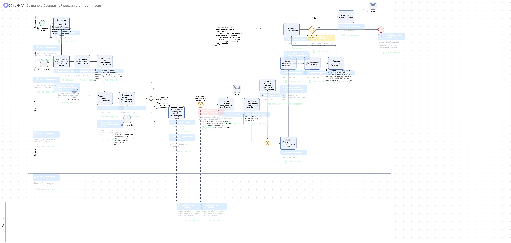
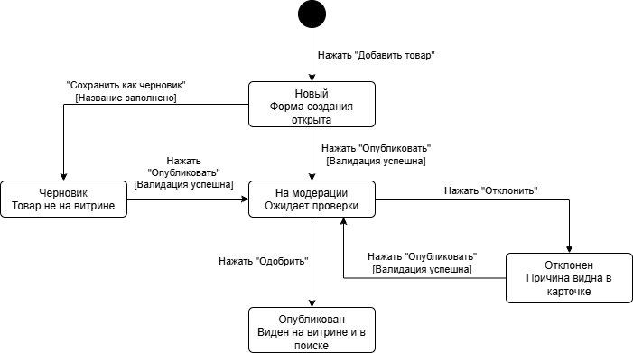
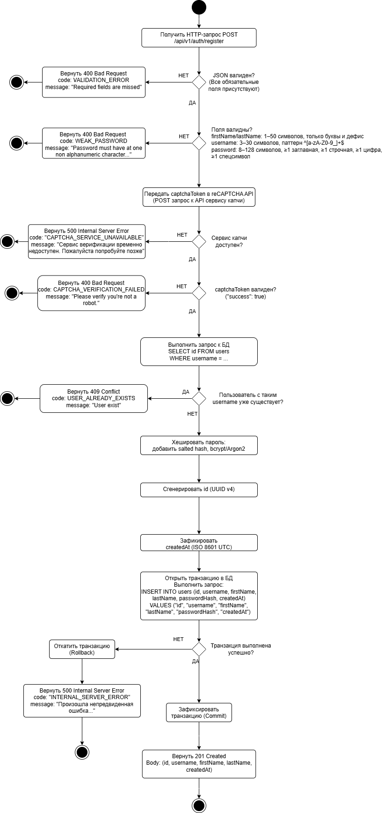

# Тестовое задание на позицию Fullstack аналитика

## 📌 Навигация по проекту
1. [Задача 1. Процесс выдачи ИТ-оборудования (BPMN 2.0)](#task1)
2. [Задача 2. Публикация товара в ЛК Продавца (User Story, Use Cases, UML State Machine)](#task2)
3. [Задача 3. Проектирование API регистрации (OpenAPI 3.1, UML Activity Diagram)](#task3)

---

## 🛠️ Задача 1. Процесс выдачи ИТ-оборудования (BPMN 2.0)
* **Описание:** Моделирование бизнес-процесса "как есть" (As Is) взаимодействия пользователя, 1-й линии техподдержки, отдела снабжения, логистики и внешнего поставщика.
* **Схема процесса:**
  

---

## 🛒 Задача 2. Личный кабинет продавца (Маркетплейс)
* **Постановка задачи:** Сформулированы требования к новой функциональности добавления товаров на витрину.
* **Спецификация требований:** Полный текст требований (User Story, Acceptance Criteria) и детальные варианты использования (Use Cases) оформлены в отдельном документе: 👉 **[Открыть спецификацию требований в формате Markdown](./task2/use-case.md)**
* **Жизненный цикл товара в системе (UML State Machine Diagram):**
  

---

## 🔐 Задача 3. Интерфейс регистрации пользователя (REST API)
* **Спецификация контракта:** Разработан строгий контракт на стороне бэкенд-сервиса в формате OpenAPI 3.1.1, включающий валидацию полей, интеграцию с капчей и обработку клиентских/серверных ошибок.
  * 📄 [Посмотреть YAML-файл контракта](./task3/api.registerUser.yaml)
  * 🌐 **[ОТКРЫТЬ КОНТРАКТ В ИНТЕРАКТИВНОМ SWAGGER EDITOR](https://editor.swagger.io/?url=СЮДА_МЫ_ВСТАВИМ_ССЫЛКУ_НА_ШАГЕ_3)**
* **Алгоритм обработки запроса на бэкенде (UML Activity Diagram):**
  
